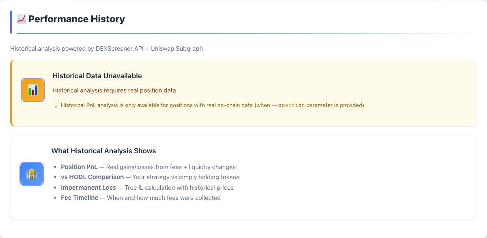

# DeFi CLI

<p>
<a href="https://github.com/fabiotreze/defi-cli/actions/workflows/ci.yml"></a>
<a href="https://www.python.org/downloads/"></a>
<a href="LICENSE"></a>
<a href="CHANGELOG.md"></a>
<a href="SECURITY.md"></a>
<a href="COMPLIANCE.md"></a>
</p>

**Educational** multi-DEX V3 concentrated-liquidity analyzer with **global regulatory compliance**.  
Supports **Uniswap V3** 🦄, **PancakeSwap V3** 🥞, and **SushiSwap V3** 🍣.  
Reads real on-chain data, generates HTML reports, and performs comprehensive risk analysis.

> ⚠️ **Not financial advice.** DeFi = **HIGH RISK** including **total loss of capital**. **🇧🇷 NÃO autorizada pela CVM**. **🇺🇸 Educational tool only**. **🇪🇺 Past performance ≠ future results**. Use at your own risk. DYOR.

## 🛡️ **Global Regulatory Compliance**

**Industry-leading compliance** across major jurisdictions:
- **🇧🇷 Brasil**: CVM Art. 11 compliant, Lei 14.478/22 crypto asset warnings, LGPD privacy-by-design
- **🇺🇸 United States**: SEC forward-looking statements, educational tool disclaimers, non-investment advice
- **🇪🇺 European Union**: MiCA regulation compliant, past performance disclaimers, GDPR privacy protection
- **🌍 International**: FATF/IOSCO standards, mathematical transparency, source code audit (344 tests)

**Unique differentiators**:
- ✅ **Source Code Transparency**: MIT License + 344 automated tests
- ✅ **Multi-Source Validation**: On-chain + DEXScreener + DefiLlama cross-verification
- ✅ **Regulatory Warnings**: Comprehensive disclaimers for APR snapshot bias, IL underestimation
- ✅ **Privacy Protection**: Zero data collection, temporary reports, consent recording

---

## Install

**macOS / Linux**

```bash
git clone https://github.com/fabiotreze/defi-cli.git
cd defi-cli
python3 -m venv defi_env && source defi_env/bin/activate
pip install -r requirements.txt && pip install -e .
```

**Windows (PowerShell)**

```powershell
git clone https://github.com/fabiotreze/defi-cli.git
cd defi-cli
python -m venv defi_env; defi_env\Scripts\activate
pip install -r requirements.txt; pip install -e .
```

---

## Commands

> **Tip:** Run `python run.py --help` to see all available commands, options, and examples.

### `report` — Generate HTML Report

📊 **Real Position Analysis** with multi-source validation and regulatory compliance

```bash
python run.py report \
  --pool <POOL_ADDRESS> \
  --position <POSITION_ID> \
  --wallet <WALLET_ADDRESS> \
  --network <NETWORK> \
  --dex <DEX>
```

**Unique features:**
- 🔍 **Auto-detection:** Pool + network detection from Position ID only
- 🗂️ **Tab-based UI:** Modern interface with 7 organized sections for better UX
- 📈 **Historical analysis:** PnL vs HODL comparison with real performance tracking
- 🔐 **Consent required:** Explicit user agreement before report generation
- 💾 **Temporary reports:** Opens in browser, auto-deleted (privacy-by-design)
- 🔗 **Cross-validation:** Links to Revert, Zerion, DeBank for verification
- ⛓️ **Multi-source data:** On-chain + DEXScreener + DefiLlama validation
- 📋 **Audit trail:** Real transaction history for actual positions

| Parameter | Required For | Without It |
|-----------|-------------|------------|
| `--pool` | Target pool | Required (or auto-detected from `--position`) |
| `--position` | Real on-chain data + audit trail | **Simulated data mode** |
| `--wallet` | Cross-validation links (Revert, Zerion, DeBank) | Links won't work |
| `--network` | Correct RPC + explorer links | **Auto-detected** or defaults to `arbitrum` |
| `--dex` | Non-Uniswap positions | Defaults to `uniswap_v3` |

### `list` — Scan Wallet for V3 Positions

```bash
python run.py list <WALLET_ADDRESS> --network <NETWORK> --dex <DEX>
```

### `pool` — Analyze Any Pool

```bash
python run.py pool --pool <POOL_ADDRESS>
```

### `scout` — Compare Pools for a Token Pair

🔭 **Pool Discovery** via DefiLlama Yields API (20,000+ pools, free, no API key)

```bash
python run.py scout <PAIR> --network <NETWORK> --dex <DEX> --sort <apy|tvl|volume|efficiency> --limit <N> --min-tvl <USD>
```

**What it does:**
- Searches **all major DEXes** for best pools (Uniswap V3, PancakeSwap V3, SushiSwap V3)
- **Real APY data** from DefiLlama (includes fee rewards + incentives)
- **Cross-chain comparison** across Ethereum, Arbitrum, Polygon, Base, Optimism, BSC
- **Efficiency ranking** by Vol/TVL ratio (higher = more active trading)

**Advanced options:**
- `--limit 15` — Max results (default: 15)
- `--min-tvl 50000` — Minimum TVL in USD (default: $50K)

### `check` · `info`

| Command | Description |
|---------|-------------|
| `python run.py check` | Integration tests against live pools |
| `python run.py info` | System info + supported DEXes |

---

## Report Modes

### 🏃 **Quick Mode** (Auto-detection)
```bash
# Only Position ID needed → Auto-detects network + pool + DEX
python run.py report --position 5260106

# Specify network if auto-detection fails
python run.py report --position 5260106 --network arbitrum
```

### 📊 **Full Mode** (Maximum accuracy)
```bash
# All parameters → Real on-chain data + audit trail + cross-validation
python run.py report \
  --pool 0x641C00A822e8b671738d32a431a4Fb6074E5c79d \
  --position 5260106 \
  --wallet 0x4819A678A5Ba46A5108765FE3db9Ab522543F3d4 \
  --network arbitrum \
  --dex uniswap_v3
```

### 🎭 **Simulation Mode** (No position)
```bash
# Pool analysis only → Simulated position data
python run.py report --pool 0x641C00A822e8b671738d32a431a4Fb6074E5c79d
```

---

## Full Example — Best Experience

> **All parameters = full report with real on-chain data, audit trail, and cross-validation links.**

```bash
python run.py report \
  --pool 0x641C00A822e8b671738d32a431a4Fb6074E5c79d \
  --position 5260106 \
  --wallet 0x4819A678A5Ba46A5108765FE3db9Ab522543F3d4 \
  --network arbitrum \
  --dex uniswap_v3
```

```bash
python run.py list 0x4819A678A5Ba46A5108765FE3db9Ab522543F3d4 --network arbitrum

python run.py scout WETH/USDC --network arbitrum --sort efficiency --limit 10

python run.py pool 0x641C00A822e8b671738d32a431a4Fb6074E5c79d
```

```bash
python run.py scout WETH/USDT --network arbitrum --sort apy --limit 5
```

### How to Find Your Position ID

1. [app.uniswap.org](https://app.uniswap.org) → **Pool** → click your position  
2. URL: `/positions/v3/<network>/<position_id>`  
3. Pool link (e.g. "WETH/USDT 0.05%") → contains the pool address  

---

## Parameters

### **Core Parameters**

| Parameter | Commands | Values | Default | Description |
|-----------|----------|--------|---------|-------------|
| `--network` | `list`, `report`, `scout` | `arbitrum` · `ethereum` · `polygon` · `base` · `optimism` · `bsc` | `arbitrum` | Blockchain network to scan |
| `--dex` | `list`, `report`, `scout` | `uniswap_v3` · `pancakeswap_v3` · `sushiswap_v3` | `uniswap_v3` | DEX protocol to use |
| `--pool` | `report`, `pool` | `0x...` (42 hex chars) | *(required)* | Pool contract address |
| `--position` | `report` | Integer (e.g. `5260106`) | *(optional)* | Position NFT Token ID |
| `--wallet` | `list`, `report` | `0x...` (42 hex chars) | *(optional)* | Wallet address for cross-validation |

### **Scout-Specific Parameters**

| Parameter | Description | Values | Default | Example |
|-----------|-------------|--------|---------|---------|
| `--sort` | Sort pools by metric | `apy` · `tvl` · `volume` · `efficiency` | `apy` | `--sort efficiency` |
| `--limit` | Max results returned | Integer (1-100) | `15` | `--limit 10` |
| `--min-tvl` | Minimum pool TVL filter | USD amount | `50000` | `--min-tvl 100000` |

### **Auto-Detection Features**

| Feature | Commands | Description |
|---------|----------|-------------|
| **Network auto-detect** | `report` | Scans all networks to find Position ID |
| **Pool auto-detect** | `report` | Extracts pool address from Position NFT |
| **DEX auto-detect** | `report` | Identifies DEX from contract address |

---

## Supported Networks & DEXes

| DEX | Networks | Position Manager |
|-----|----------|-----------------|
| 🦄 Uniswap V3 | ETH, ARB, POLY, BASE, OP | `0xC364…FE88` (Base: `0x03a5…4f1`) |
| 🥞 PancakeSwap V3 | ETH, BSC, ARB, BASE | `0x46A1…4364` (ARB: `0x427b…96c1`) |
| 🍣 SushiSwap V3 | ETH, ARB, POLY, BASE, OP | Per-chain ([dex_registry.py](defi_cli/dex_registry.py)) |

All RPC calls go through [1RPC.io](https://docs.1rpc.io/web3-relay/overview) — privacy-preserving TEE relay (no API keys, no tracking).

| Network | RPC | Explorer |
|---------|-----|----------|
| Arbitrum | `1rpc.io/arb` | [arbiscan.io](https://arbiscan.io) |
| Ethereum | `1rpc.io/eth` | [etherscan.io](https://etherscan.io) |
| Polygon | `1rpc.io/matic` | [polygonscan.com](https://polygonscan.com) |
| Base | `1rpc.io/base` | [basescan.org](https://basescan.org) |
| Optimism | `1rpc.io/op` | [optimistic.etherscan.io](https://optimistic.etherscan.io) |
| BSC | `1rpc.io/bnb` | [bscscan.com](https://bscscan.com) |

Pool data via [DEXScreener API](https://docs.dexscreener.com/api/reference) — supports all DEXes on 50+ networks. **No API keys required.**

---

## Report Preview

<p align="center">
<a href="docs/screenshots/01_header.png"></a>
</p>

<details>
<summary><strong>View all report tabs (7 sections)</strong></summary>
<br>

| Tab | Preview |
|-----|---------|
| 💼 Your Position | <a href="docs/screenshots/02_position.png"></a> |
| 📈 Performance History | <a href="docs/screenshots/08_performance.png"></a> |
| 🏊 Pool Overview | <a href="docs/screenshots/03_pool_stats.png"></a> |
| 🎯 Strategy & Risk | <a href="docs/screenshots/04_strategies.png"></a> |
| 🔧 Technical Details | <a href="docs/screenshots/05_technical.png"></a> |
| 📝 Audit Trail | <a href="docs/screenshots/06_audit_trail.png"></a> |
| ⚖️ Legal Compliance | <a href="docs/screenshots/07_legal.png"></a> |

</details>

Reports feature a **modern tab-based interface** for easy navigation between sections. No more scrolling through long pages — jump directly to any analysis section with one click.

Reports are **temporary by design** — opened in your browser, then discarded. Press **Ctrl+S** / **⌘+S** to save.

---

## Known Limitations

| Limitation | Impact | Status |
|-----------|--------|--------|
| **Historical data coverage** | Some pools may have limited historical data | ⚠️ API-dependent |
| **24h snapshot** | Projections may differ 20–30% from actual averages | ⚠️ Inherent to DEX APIs |
| **Gas cost analysis** | Fee APR ≠ Total PnL — use [Revert.finance](https://revert.finance) for gas tracking | 🔄 Planned feature |
| **Mathematical examples** | Strategies are formulas, not investment recommendations | ⚠️ Educational tool |

---

## Data Sources & Technical References

### Protocol Documentation

| Source | Provides | Docs |
|--------|----------|------|
| Uniswap V3 Core | sqrtPriceX96, tick math, liquidity, fees | [Whitepaper](https://uniswap.org/whitepaper-v3.pdf) · [Concepts](https://docs.uniswap.org/concepts/protocol/concentrated-liquidity) |
| Uniswap V3 Contracts | Position Manager, Factory, Pool | [Deployments](https://docs.uniswap.org/contracts/v3/reference/deployments/) · [v3-core](https://github.com/Uniswap/v3-core) · [v3-periphery](https://github.com/Uniswap/v3-periphery) |
| Uniswap V3 SDK | Tick/price helpers, liquidity math | [SDK Overview](https://docs.uniswap.org/sdk/v3/overview) · [Dev Book](https://uniswapv3book.com/) |
| PancakeSwap V3 | Position data (same ABI as Uniswap V3) | [Addresses](https://developer.pancakeswap.finance/contracts/v3/addresses) · [Overview](https://developer.pancakeswap.finance/contracts/v3/overview) |
| SushiSwap V3 | Position data (same ABI as Uniswap V3) | [Addresses](https://docs.sushi.com/docs/Products/V3%20AMM/Periphery/Deployment%20Addresses) · [Core](https://docs.sushi.com/docs/Products/V3%20AMM/Core/Overview) |

### APIs & Data Providers

| Source | Provides | Docs |
|--------|----------|------|
| DEXScreener API | Pool metrics, volume, TVL, price | [API Reference](https://docs.dexscreener.com/api/reference) |
| DefiLlama Yields API | Cross-DEX pool discovery, APY | [API Docs](https://defillama.com/docs/api) |
| 1RPC.io TEE Relay | Privacy-preserving JSON-RPC | [Overview](https://docs.1rpc.io/web3-relay/overview) |
| Revert.finance | PnL cross-validation, historical data | [App](https://revert.finance) |

### Standards & Specifications

| Standard | Used For | Spec |
|----------|----------|------|
| Ethereum JSON-RPC | `eth_call`, `eth_getCode`, `eth_blockNumber` | [Spec](https://ethereum.org/en/developers/docs/apis/json-rpc/) |
| Solidity ABI Encoding | Manual calldata encoding/decoding | [ABI Spec](https://docs.soliditylang.org/en/latest/abi-spec.html) |
| ERC-721 (NFT) | V3 Position NFTs (NonfungiblePositionManager) | [EIP-721](https://eips.ethereum.org/EIPS/eip-721) |
| ERC-20 | Token decimals/symbol metadata | [EIP-20](https://eips.ethereum.org/EIPS/eip-20) |
| Pintail IL Formula | Impermanent loss calculation | [Article](https://pintail.medium.com/uniswap-a-good-deal-for-liquidity-providers-104c0b6816f2) |

---

## Testing

```bash
pip install pytest
python -m pytest tests/ -v --tb=short
```

> `pytest` is a dev-only dependency. The command above runs all 344 tests.

| Suite | Tests | Scope |
|-------|-------|-------|
| `test_math.py` | 83 | V3 math formulas, metrics, edge cases |
| `test_units.py` | 231 | CLI commands, HTML output, EASM regression, mocked integration |
| `test_codereview.py` | 30 | Code quality, security mitigations (T06–T40), live network checks |
| **Total** | **344** | **Complete test coverage** |

---

## Dependencies

| Package | Version | Purpose |
|---------|---------|---------|
| Python | ≥ 3.10 | Runtime |
| httpx | ≥ 0.27.0 | HTTP client (API + JSON-RPC) |
| pytest | ≥ 8.0 | Testing (dev only) |

| OS | Python | Status |
|----|--------|--------|
| macOS Sequoia 15.3 (ARM64) | 3.14 | ✅ |
| Windows 11 (x64) | 3.11 | ✅ |
| Ubuntu 24.04 (x64) | 3.12 | ✅ |

---

## Uninstall

**macOS / Linux**

```bash
deactivate && cd .. && rm -rf defi-cli/
```

**Windows (PowerShell)**

```powershell
deactivate; cd ..; Remove-Item -Recurse -Force defi-cli\
```

> **Zero residue.** Everything lives inside the project folder — nothing touches your system.

---

## Legal

**MIT License** ([LICENSE](LICENSE)) · Not financial advice · No warranty · No liability  
See [SECURITY.md](SECURITY.md) · [COMPLIANCE.md](COMPLIANCE.md)

---

## Support

If you find this tool useful, consider giving it a ⭐ on GitHub!
