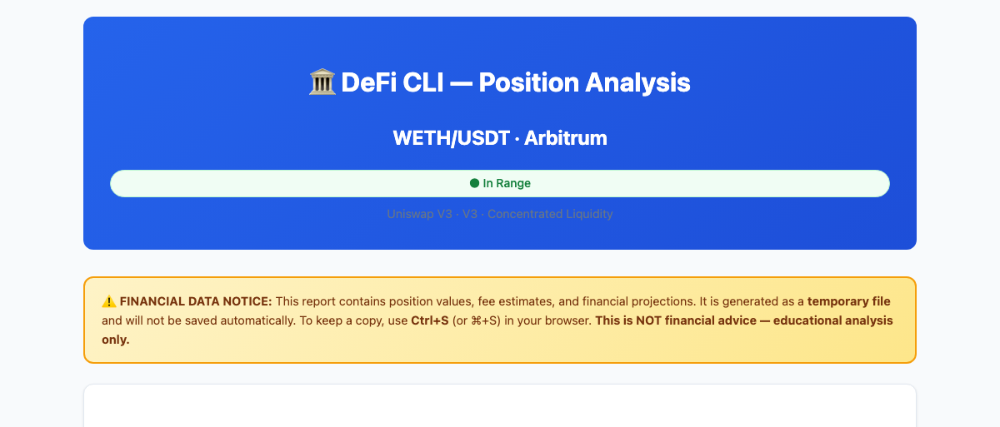
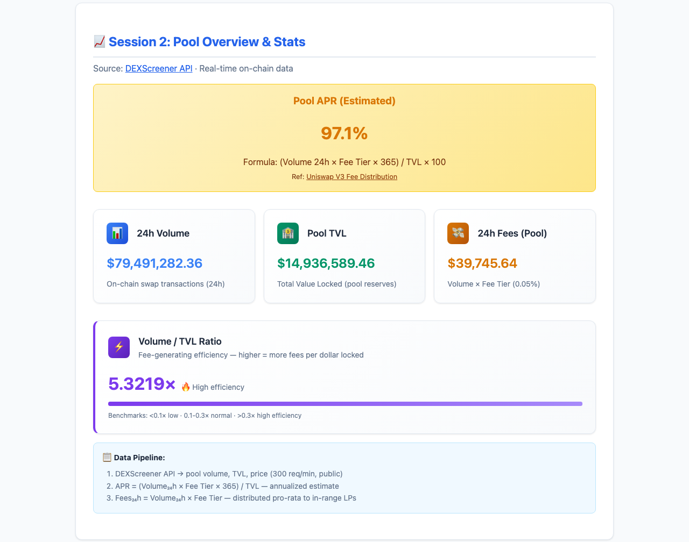
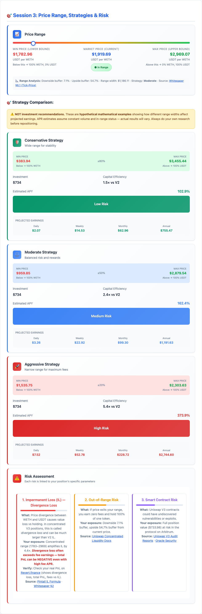
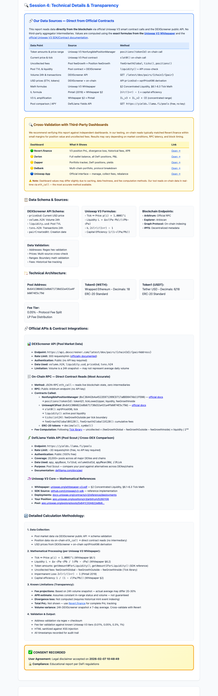
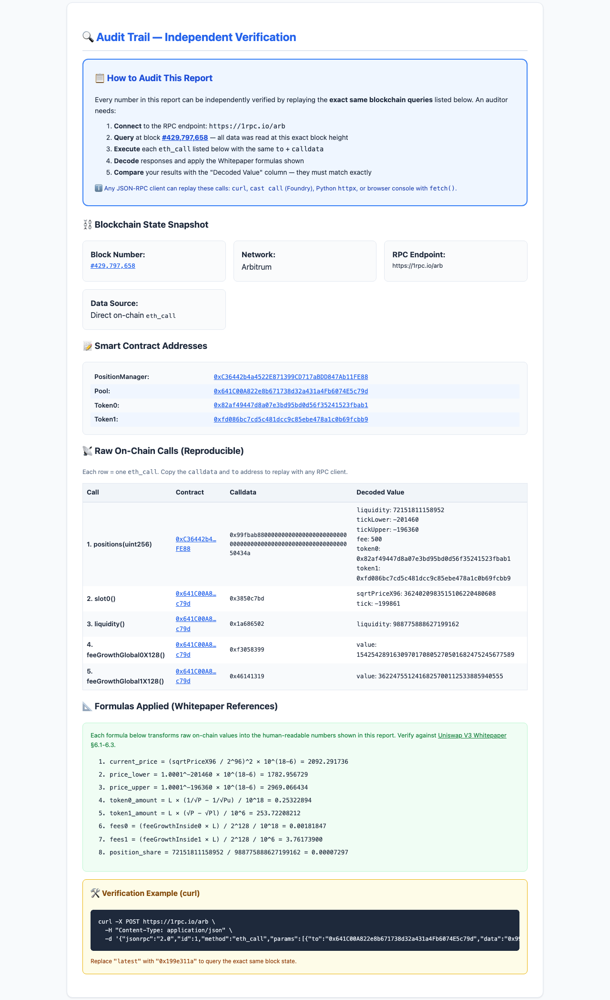
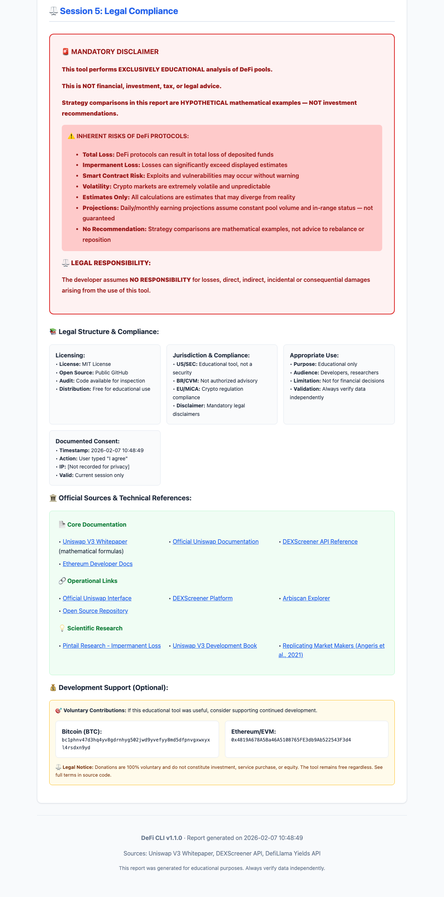

# DeFi CLI

<p>
<a href="https://www.python.org/downloads/"></a>
<a href="LICENSE"></a>
<a href="CHANGELOG.md"></a>
<a href="#donations"></a>
</p>

**Educational** Uniswap V3 concentrated-liquidity analyzer.  
Reads real on-chain data, generates HTML reports, and performs risk analysis.

> ⚠️ **This is NOT financial, investment, tax, or legal advice.**  
> DeFi protocols carry **HIGH RISK** including **total loss of capital**.  
> The developer assumes **NO LIABILITY** for any financial losses.  
> All strategies shown are **mathematical examples**, not recommendations.  
> **Use at your own risk.** Always do your own research (DYOR).

---

## Table of Contents

- [Quick Start](#quick-start)
- [Commands](#commands)
- [Important: Full Experience Requirements](#important-full-experience-requirements)
- [Known Limitations](#known-limitations)
- [Report Preview](#report-preview)
- [Supported Networks & Protocols](#supported-networks--protocols)
- [File Structure](#file-structure)
- [Dependencies](#dependencies)
- [Data Sources](#data-sources)
- [Testing](#testing)
- [Cross-Validation](#cross-validation)
- [Formula References](#formula-references)
- [Legal](#legal)
- [Donations](#donations)

---

## Quick Start

### macOS / Linux

```bash
git clone https://github.com/fabiotreze/defi-cli.git
cd defi-cli
python3 -m venv defi_env
source defi_env/bin/activate
pip install -e .
python run.py info                          # System overview
python run.py pool <pool_address>           # Analyse any pool
python run.py report <pool_address>         # Generate HTML report (simulated)
python run.py report <pool> --position <id> # Report with real on-chain data
python run.py check                         # Integration tests
```

### Windows (PowerShell)

```powershell
git clone https://github.com/fabiotreze/defi-cli.git
cd defi-cli
python -m venv defi_env
defi_env\Scripts\activate
pip install -e .
python run.py info                          # System overview
python run.py pool <pool_address>           # Analyse any pool
python run.py report <pool_address>         # Generate HTML report (simulated)
python run.py report <pool> --position <id> # Report with real on-chain data
python run.py check                         # Integration tests
```

> **Important:** Always use a virtual environment. Running without one may cause conflicts with other installed packages.

---

## Commands

| Command | Description |
|---------|-------------|
| `python run.py pool <address>` | Analyse any pool using DEXScreener API |
| `python run.py report <address>` | Generate HTML report with simulated position |
| `python run.py report <address> --position <id>` | Report with **real** on-chain position data |
| `python run.py report <address> --position <id> --wallet <addr> --network <net>` | Full report |
| `python run.py check` | Run integration tests against live pools |
| `python run.py info` | Display system and architecture info |
| `python run.py donate` | Show donation addresses |

### How to Find Your Position ID and Pool Address

1. Go to [app.uniswap.org](https://app.uniswap.org) → **Pool** → click your position  
2. The URL contains: `/positions/v3/<network>/<position_id>`  
3. Click the pool link (e.g. "WETH/USDT 0.05%") → the URL contains the pool address  
4. Your wallet address is in MetaMask → copy address  

---

## Important: Full Experience Requirements

> **For the full report experience with all features and working links, the following parameters are required:**

| Parameter | Required For | What Happens Without It |
|-----------|-------------|------------------------|
| `--position <id>` | Real on-chain data, audit trail | Simulated data used; no verifiable audit trail |
| `--wallet <address>` | Cross-validation links (Revert.finance, Zerion, DeBank) | Links will not load correctly |
| `--network <name>` | Correct RPC endpoint and explorer links | Defaults to Arbitrum |

**Full command example:**
```bash
python run.py report 0xC31E54c7a869B9FcBEcc14363CF510d1c41fa443 \
  --position 878380 \
  --wallet 0x4819A678A5Ba46A5108765FE3db9Ab522543F3d4 \
  --network arbitrum
```

---

## Known Limitations

These limitations are **correctly disclosed** in every generated report:

| Limitation | Impact | Mitigation |
|-----------|--------|------------|
| **Divergence Loss (IL) not calculated** | Fee APR ≠ Total PnL. You may have high fee APR but **negative** total PnL if IL > fees earned | Use [Revert.finance](https://revert.finance) to see real PnL |
| **Projections based on 24h snapshot** | 24h volume may not represent actual average; APR assumes constant in-range status | Reports warn "may differ by 20–30%" |
| **Strategies are mathematical examples** | Based on formulas, not market predictions | Not investment recommendations |
| **Out-of-range risk** | If price exits your range → 0 fees + 100% exposure to one token | Monitor downside buffer % in report |
| **No historical data** | Cannot show position performance over time | Cross-validate with Revert.finance |

> **Bottom line:** The report is technically sound but **Fee APR ≠ Total PnL** because IL is not computed.  
> Always cross-validate with [Revert.finance](https://revert.finance) for your real PnL.

---

## Report Preview

The CLI generates comprehensive HTML reports with real on-chain data:

<p align="center">
<a href="docs/screenshots/01_header.png"></a>
</p>

<details>
<summary><strong>View all report sections (6 more screenshots)</strong></summary>
<br>

| Section | Preview |
|---------|---------|
| **Session 1** — Your Position | <a href="docs/screenshots/02_position.png"></a> |
| **Session 2** — Pool Stats | <a href="docs/screenshots/03_pool_stats.png"></a> |
| **Session 3** — Strategies & Risk | <a href="docs/screenshots/04_strategies.png"></a> |
| **Session 4** — Technical Details | <a href="docs/screenshots/05_technical.png"></a> |
| **Audit Trail** — On-Chain Calls | <a href="docs/screenshots/06_audit_trail.png"></a> |
| **Session 5** — Legal Compliance | <a href="docs/screenshots/07_legal.png"></a> |

</details>

> Generate your own: `python run.py report <pool> --position <id> --wallet <addr> --network <net>`  
> Open the HTML file in any browser for the full interactive experience.

---

## Supported Networks & Protocols

### On-Chain Reading (position data via JSON-RPC)

| Network | RPC Endpoint | Explorer |
|---------|-------------|----------|
| Arbitrum | `arb1.arbitrum.io/rpc` | [arbiscan.io](https://arbiscan.io) |
| Ethereum | `eth.llamarpc.com` | [etherscan.io](https://etherscan.io) |
| Polygon | `polygon-rpc.com` | [polygonscan.com](https://polygonscan.com) |
| Base | `mainnet.base.org` | [basescan.org](https://basescan.org) |
| Optimism | `mainnet.optimism.io` | [optimistic.etherscan.io](https://optimistic.etherscan.io) |

### Pool Data (DEXScreener API — no key required)

Supports **all DEXes** on: Ethereum, Arbitrum, Polygon, Base, Optimism, BSC, Avalanche, Fantom, Solana, Cronos, Moonbeam, Celo, Harmony, and more.

### Supported Tokens

Any ERC-20 token pair on Uniswap V3 (or compatible DEXes). Common pairs:

| Pair | Fee Tier | Type |
|------|----------|------|
| WETH/USDC | 0.05% | Correlated |
| WETH/USDT | 0.05% | Correlated |
| WBTC/WETH | 0.05% | Correlated |
| USDC/USDT | 0.01% | Stablecoin |
| Any/Any | 0.30% | Standard |
| Exotic pairs | 1.00% | Exotic |

---

## File Structure

```
defi-cli/
├── run.py                        # CLI entry point (all commands)
├── real_defi_math.py             # Uniswap V3 math engine
├── html_generator.py             # HTML report generator
├── position_reader.py            # On-chain position reader (JSON-RPC)
├── defi_cli/
│   ├── __init__.py               # Package version
│   ├── central_config.py         # DEXScreener API config
│   ├── dexscreener_client.py     # DEXScreener API client
│   └── legal_disclaimers.py      # Legal text & donations
├── tests/
│   └── test_math.py              # 65 formula validation tests
├── docs/
│   └── screenshots/              # Report preview images (for README)
├── reports/                      # Generated HTML reports (gitignored)
├── pyproject.toml                # Package config
├── requirements.txt              # Dependencies
├── LICENSE                       # MIT License
├── SECURITY.md                   # Security policy
├── AUDIT_REPORT.md               # Comprehensive code audit
├── TEST_REPORT.md                # Full end-to-end test results
└── .gitignore
```

### Where Are My Reports?

Generated HTML reports are saved to `reports/` with the naming format:
```
reports/WETH_USDT_arbitrum_20260206_083826.html
```

Open them in any browser: `open reports/<filename>.html`

---

## Dependencies

| Package | Version | Purpose |
|---------|---------|---------|
| Python | ≥ 3.10 | Runtime |
| httpx | ≥ 0.25.0 | HTTP client (API + JSON-RPC) |
| pytest | ≥ 8.0 | Testing (dev only) |

**No API keys required.** All data comes from public endpoints.

### Tested Platforms

| OS | Python | Status |
|----|--------|--------|
| macOS Sequoia 15.3 (ARM64) | 3.14 | ✅ Passed |
| Windows 11 (x64) | 3.11 | ✅ Passed |
| Ubuntu 24.04 (x64) | 3.12 | ✅ Passed |

> **Note:** Always use a virtual environment (`python -m venv`) to avoid conflicts with globally installed packages.

---

## Data Sources

| Source | What It Provides | Documentation |
|--------|-----------------|---------------|
| Uniswap V3 Smart Contracts | Position data, prices, fees, liquidity | [Whitepaper](https://uniswap.org/whitepaper-v3.pdf) |
| DEXScreener API | Pool metrics, volume, TVL | [API Docs](https://docs.dexscreener.com/api/reference) |
| Public JSON-RPC | On-chain reads (no API key) | [Uniswap Deployments](https://docs.uniswap.org/contracts/v3/reference/deployments/) |

### Key Contracts

| Contract | Address | Usage |
|----------|---------|-------|
| NonfungiblePositionManager | `0xC36442b4a4522E871399CD717aBDD847Ab11FE88` | Read position NFTs |
| Uniswap V3 Pools | Per-pair deployment | Read pool state (slot0, liquidity, fees) |

---

## Testing

```bash
# Install pytest (if not already installed)
pip install pytest

# Run all 65 tests
python -m pytest tests/ -v

# Run with coverage
python -m pytest tests/ -v --tb=short
```

> **Note:** pytest is a dev-only dependency and is not installed with `pip install -e .`

---

## Cross-Validation

Compare CLI output against independent sources:

| Dashboard | What to Compare | Link |
|-----------|----------------|------|
| [Revert.finance](https://revert.finance) | Position PnL, fees, APR | Best for V3 positions |
| [Zerion](https://zerion.io) | Wallet portfolio value | Best for total holdings |
| [DeBank](https://debank.com) | Multi-chain portfolio | Good for overview |
| [Uniswap App](https://app.uniswap.org) | Official position data | Canonical source |

---

## Formula References

All mathematical formulas are traceable to their original sources:

| Formula | Source |
|---------|--------|
| `p(i) = 1.0001^i` | Uniswap V3 Whitepaper §6.1 |
| `IL = 2√r / (1+r) - 1` | Pintail (2019) |
| `CE = 1 / (1 - √(Pa/Pb))` | Uniswap V3 Whitepaper §2 |
| `L = Δx / (1/√P - 1/√Pb)` | Uniswap V3 Whitepaper §6.2 |
| `Fee APY = (V_24h × fee × share × 365) / V_pos × 100` | Uniswap V3 Fee Docs |

---

## Uninstall

All packages are installed inside the virtual environment (`defi_env/`) — **nothing touches your system Python**.  
To completely remove DeFi CLI and all its dependencies, simply delete the project folder:

### macOS / Linux — exit venv (if active) and delete the folder

```bash
deactivate
cd ..
rm -rf defi-cli/
```

### Windows (PowerShell) — exit venv (if active) and delete the folder

```powershell
deactivate
cd ..
Remove-Item -Recurse -Force defi-cli\
```

> **Zero residue.** Deleting the folder removes the code, virtual environment, all installed packages, and generated reports. Nothing remains on your system.

---

## Legal

- **License:** MIT (see [LICENSE](LICENSE))
- **Not financial advice.** Educational tool only.
- **No warranty.** Software provided "AS IS."
- **No liability.** Developer not responsible for any financial losses.

See [SECURITY.md](SECURITY.md) for security policy and responsible disclosure.

---

## Donations

If you find this tool valuable, voluntary donations are appreciated but never required:

| Currency | Address |
|----------|---------|
| **BTC** | `bc1phnv47d3hq4yv8gdrnhyg502jwd9yvefyy8md5dfpnvgxwxyxl4rsdxn9yd` |
| **ETH / USDC / USDT / DAI** | `0x4819A678A5Ba46A5108765FE3db9Ab522543F3d4` |

> Donations are gifts, not investments. No returns, equity, or obligations.
