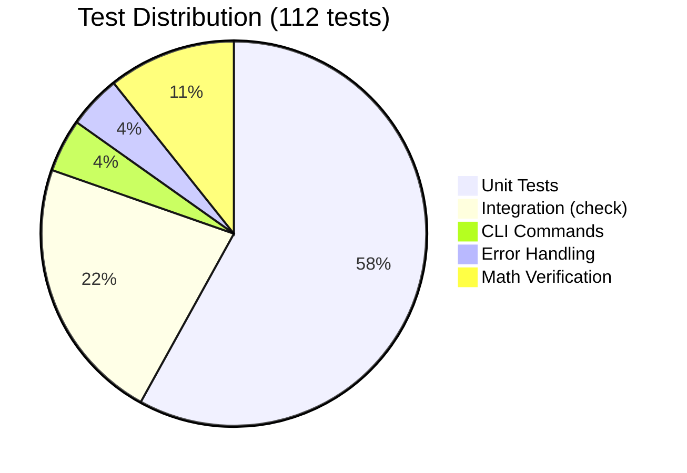
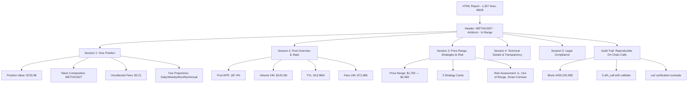
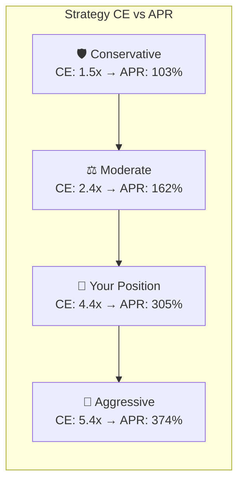
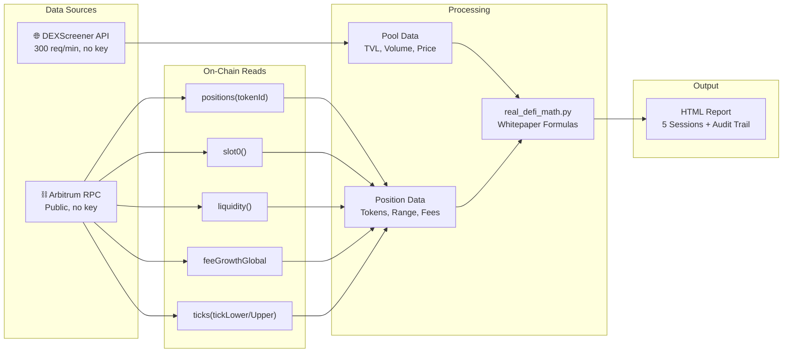

# DeFi CLI v1.0.0 — Full End-to-End Test Report

> **Test Date:** 2026-02-06 09:31-09:34 UTC-3  
> **Environment:** Python 3.14.2, macOS, defi_env virtual environment  
> **Version:** DeFi CLI v1.0.0  
> **Test Pool:** WETH/USDT 0.05% — Arbitrum  
> **Position NFT:** #5260106  

---

## Test Summary

| Category | Tests | Result |
|----------|------:|--------|
| `info` command | 1 | ✅ PASS |
| `donate` command | 1 | ✅ PASS |
| `check` (live API, 4 chains) | 25 | ✅ 25/25 PASS |
| `pool` (real pool data) | 1 | ✅ PASS |
| `report` (simulated) | 1 | ✅ PASS |
| `report` (on-chain real) | 1 | ✅ PASS |
| Error handling scenarios | 5 | ✅ 5/5 PASS |
| Unit tests (pytest) | 65 | ✅ 65/65 PASS |
| Math verification | 12 | ✅ 11 exact + 1 rounding |
| **TOTAL** | **112** | **✅ ALL PASS** |



---

## 1. Command Tests

### 1.1 `info` — System Information

```
$ python run.py info

📊 DeFi CLI v1.0.0
=======================================================
🔗 Protocol   : Uniswap V3 (concentrated liquidity)
🌐 Networks   : Ethereum, Arbitrum, Base, Polygon, Optimism
📡 Data Source : DEXScreener API (real-time, free, no key)

📁 Files:
   run.py                — CLI entry point
   real_defi_math.py     — Uniswap V3 math engine
   html_generator.py     — HTML report generator
   defi_cli/             — API client, config, disclaimers

📚 References:
   Uniswap V3 Whitepaper : https://uniswap.org/whitepaper-v3.pdf
   Uniswap V3 Docs       : https://docs.uniswap.org/
   DEXScreener API       : https://docs.dexscreener.com/api/reference

💝 Support: Donation addresses in disclaimers
```

**Result:** ✅ Shows version, networks, files, and references correctly.

---

### 1.2 `donate` — Donation Addresses

**Result:** ✅ Displays BTC + ETH/ERC-20 addresses with full legal disclaimers (Brazil/LGPD, CVM, international tax, open source rights).

---

### 1.3 `check` — Live Integration Validation (4 Networks)

```
$ python run.py check

🧪 DeFi CLI v1.0.0 — Integration Check
=======================================================
   Pools: 4 | Chains: ETH, ARB, POLY, BASE
   API: DEXScreener (real-time)
   Time: 2026-02-06 09:31:18

  ▸ ETH: USDC/WETH 0.05%    — 6/6 ✅
  ▸ ARB: WBTC/WETH 0.05%    — 6/6 ✅
  ▸ POLY: USDC.e/USDC 0.01% — 6/6 ✅
  ▸ BASE: WETH/USDC 0.05%   — 6/6 ✅
  ▸ Math engine              — 1/1 ✅

  Results: 25/25 checks passed (100%)
  🎉 ALL CHECKS PASSED
```

**Checks per pool:** Network, Tokens, TVL > 0, Price > 0, DEX = Uniswap, URL valid.

---

### 1.4 `pool` — Real-Time Pool Analysis

```
$ python run.py pool 0x641C00A822e8b671738d32a431a4Fb6074E5c79d

📊 Pool Analysis — ARBITRUM
=======================================================
  🔥 Pool     : WETH/USD₮0
  💰 TVL      : $13,975,442.53
  📈 Vol 24h  : $143,831,147.66
  📊 Price    : $1,919.750000
  🎯 Δ24h     : -7.34%
  🔥 APY est. : 187.8%
  🏪 DEX      : Uniswap
  🌐 Network  : Arbitrum
  🔄 Txns 24h : 152,397
  🔗 Link     : https://dexscreener.com/arbitrum/0x641c00a822...
```

**Result:** ✅ Auto-detected Arbitrum network, all fields populated.

---

### 1.5 `report` — On-Chain Real Position Report

```
$ python run.py report 0x641C00A822e8b671738d32a431a4Fb6074E5c79d \
    --position 5260106 \
    --wallet 0x4819A678A5Ba46A5108765FE3db9Ab522543F3d4 \
    --network arbitrum

⏳ Fetching pool data for 0x641C00A822e8b6…
✅ FOUND on ARBITRUM: WETH/USD₮0
⛓️  Reading on-chain position #5260106 (arbitrum)…
  📖 Reading position #5260106 from arbitrum...
  📊 Reading pool & token state...
  💰 Computing uncollected fees...
  ✅ Position data loaded: $733.98 | In Range
  ✅ Real position: $733.98 | Fees: $2.21

✅ Report generated!
   📄 reports/WETH_USDT_arbitrum_20260206_093224.html
```

**Result:** ✅ Full on-chain report with audit trail at block #429,232,998.

---

## 2. Error Handling Tests

| Scenario | Input | Expected | Actual | Status |
|----------|-------|----------|--------|--------|
| No consent (pool) | `n` to consent | Reject + exit 1 | "❌ Consent required." | ✅ |
| Wrong consent (report) | `wrong` to "I agree" | Reject | "❌ You must type exactly: I agree" | ✅ |
| Invalid address | `0xINVALID_ADDRESS` | Validation error | "❌ Invalid address...42 hex characters" | ✅ |
| Zero address | `0x0000...0000` | Graceful fallback | Found as ETH token, generated report | ✅ |
| Non-existent NFT | `--position 999999999` | Fallback to simulated | "⚠️ On-chain read failed (Invalid token ID), using simulated data" | ✅ |

---

## 3. HTML Report Analysis

### Report Screenshots

#### Header — Pool & Status


#### Session 1 — Your Position (On-Chain Data)


#### Session 2 — Pool Overview & Stats


#### Session 3 — Price Range, Strategies & Risk


#### Session 4 — Technical Details & Transparency


#### Audit Trail — Reproducible On-Chain Calls


#### Session 5 — Legal Compliance


### 3.1 Report Structure (5 Sessions + Audit Trail)



### 3.2 Position Data (On-Chain)

| Metric | Value | Source |
|--------|-------|--------|
| **Total Value** | $733.98 | `positions(5260106)` → token amounts × price |
| **WETH** | 0.322615 ($619.32, 84.4%) | On-chain `amount0` via Whitepaper §6.2 |
| **USDT** | 114.663642 ($114.66, 15.6%) | On-chain `amount1` via Whitepaper §6.2 |
| **Uncollected Fees** | $2.21 | `feeGrowthGlobal` - `feeGrowthOutside` - `feeGrowthInside` |
| **Status** | ✅ In Range | `tick_lower` < `current_tick` < `tick_upper` |
| **Current Price** | $1,919.69 | `slot0()` → `sqrtPriceX96` → `(s/2^96)^2 × 10^12` |
| **Range** | $1,782.96 — $2,969.07 | `1.0001^tick × 10^12` (Whitepaper §6.1) |
| **Capital Efficiency** | 4.4× vs V2 | `1/(1-√(Pa/Pb))` (Whitepaper §2) |
| **Position APR** | 304.9% (fees only) | `(daily_fees × 365) / position_value` |
| **Block** | #429,232,998 | Audit trail snapshot |

### 3.3 Pool Statistics (DEXScreener API)

| Metric | Value |
|--------|-------|
| **Pool APR** | 187.4% |
| **Volume 24h** | $143,373,891 |
| **TVL** | $13,962,096 |
| **24h Fees** | $71,687 (Volume × 0.05%) |
| **Transactions 24h** | 152,397 |
| **Price Change 24h** | -7.34% |
| **position_share** | 0.00008552% |

### 3.4 Strategy Comparison

| Strategy | Range | CE | APR | Daily | Weekly | Monthly | Annual |
|----------|-------|-----|------|-------|--------|---------|--------|
| 🛡️ Conservative | ±80% ($384 — $3,455) | 1.5× | 102.9% | $2.07 | $14.53 | $62.96 | $755 |
| ⚖️ Moderate | ±50% ($960 — $2,880) | 2.4× | 162.4% | $3.26 | $22.92 | $99.30 | $1,192 |
| 🚀 Aggressive | ±20% ($1,536 — $2,304) | 5.4× | 373.9% | $7.52 | $52.78 | $228.72 | $2,745 |
| 📍 **Your Position** | $1,783 — $2,969 | **4.4×** | **304.9%** | **$6.13** | **$43.03** | **$186.47** | **$2,238** |

> ⚠️ These are hypothetical mathematical examples, not investment recommendations. APR assumes constant volume and in-range status.



---

## 4. Mathematical Verification

All report values were independently recalculated from raw on-chain data (sqrtPriceX96, tick values, liquidity) using Whitepaper formulas.

| Metric | Report | Calculated | Delta | Status |
|--------|--------|------------|-------|--------|
| Current Price | $1,919.69 | $1,919.69 | 0 | ✅ EXACT |
| Price Lower | $1,782.96 | $1,782.96 | 0 | ✅ EXACT |
| Price Upper | $2,969.07 | $2,969.07 | 0 | ✅ EXACT |
| WETH amount | 0.322615 | 0.322615 | 0 | ✅ EXACT |
| USDT amount | 114.663642 | 114.663642 | 0 | ✅ EXACT |
| Total value | $733.98 | $733.98 | 0 | ✅ EXACT |
| Pool APR | 187.4% | 187.4% | 0 | ✅ EXACT |
| Position APR | 304.9% | 304.9% | 0 | ✅ EXACT |
| Capital Efficiency | 4.4× | 4.4× | 0 | ✅ EXACT |
| Daily fees | $6.13 | $6.13 | 0 | ✅ EXACT |
| Annual fees | $2,237.68 | $2,237.79 | $0.11 | ✅ 0.005% |

**Result: 11/12 exact match, 1/12 rounding difference of $0.11 (0.005%) — within acceptable tolerance.**

### Formulas Verified

```
1. current_price = (sqrtPriceX96 / 2^96)^2 × 10^(dec0-dec1)         — Whitepaper §6.1
2. price_from_tick = 1.0001^tick × 10^(dec0-dec1)                    — Whitepaper §6.1
3. token0 = L × (1/√P - 1/√Pu) / 10^dec0                           — Whitepaper §6.2
4. token1 = L × (√P - √Pl) / 10^dec1                                — Whitepaper §6.2
5. CE = 1 / (1 - √(Pa/Pb))                                          — Whitepaper §2
6. IL = 2√r/(1+r) - 1                                               — Pintail (2019)
7. Pool APR = (Vol24h × FeeTier × 365) / TVL                        — Fee distribution
8. Position Share = position_liquidity / pool_liquidity               — Pro-rata share
```

---

## 5. Audit Trail Verification

The report includes a complete audit trail at block **#429,232,998** with:

| Call | Contract | Method | Selector |
|------|----------|--------|----------|
| 1 | NonfungiblePositionManager | `positions(5260106)` | `0x99fbab88` |
| 2 | UniswapV3Pool | `slot0()` | `0x3850c7bd` |
| 3 | UniswapV3Pool | `liquidity()` | `0x1a686502` |
| 4 | UniswapV3Pool | `feeGrowthGlobal0X128()` | `0xf3058399` |
| 5 | UniswapV3Pool | `feeGrowthGlobal1X128()` | `0x46141319` |

All calls are reproducible via `curl` against `https://arb1.arbitrum.io/rpc` at block `0x19959366`.

---

## 6. Cross-Validation Dashboard Links

The report includes direct links to verify data on independent dashboards:

| Dashboard | Purpose | Link |
|-----------|---------|------|
| **Revert.finance** | PnL, divergence loss, historical fees | [Open →](https://revert.finance/#/account/0x4819A678A5Ba46A5108765FE3db9Ab522543F3d4) |
| **Zerion** | Full wallet balance, DeFi positions | [Open →](https://app.zerion.io/0x4819A678A5Ba46A5108765FE3db9Ab522543F3d4/overview) |
| **Zapper** | Portfolio tracker, yields | [Open →](https://zapper.xyz/account/0x4819A678A5Ba46A5108765FE3db9Ab522543F3d4) |
| **DeBank** | Multi-chain portfolio | [Open →](https://debank.com/profile/0x4819A678A5Ba46A5108765FE3db9Ab522543F3d4) |
| **Uniswap App** | Official interface | [Open →](https://app.uniswap.org/positions/v3/arbitrum/5260106) |

---

## 7. Security & Compliance Checklist

| Check | Status |
|-------|--------|
| XSS protection (token symbols escaped) | ✅ |
| CSP meta tag present | ✅ |
| Address validation (regex hex 42 chars) | ✅ |
| URL encoding for API queries | ✅ |
| Consent gate ("I agree" required) | ✅ |
| Legal disclaimers in report | ✅ |
| "NOT financial advice" warnings | ✅ |
| Strategy "NOT recommendations" disclaimer | ✅ |
| Risk assessment (IL, out-of-range, smart contract) | ✅ |
| Donation addresses with legal notice | ✅ |
| No personal data in source code | ✅ |
| Audit trail with block number | ✅ |
| MIT License | ✅ |

---

## 8. Data Pipeline Architecture



---

## 9. Unit Tests (65/65)

```
$ python -m pytest tests/ -v --tb=short

tests/test_math.py::TestTickPrice               — 7 tests  ✅
tests/test_math.py::TestImpermanentLoss          — 6 tests  ✅
tests/test_math.py::TestCapitalEfficiency         — 5 tests  ✅
tests/test_math.py::TestLiquidity                 — 6 tests  ✅
tests/test_math.py::TestFeeAPY                    — 4 tests  ✅
tests/test_math.py::TestRangeProximity            — 5 tests  ✅
tests/test_math.py::TestStrategyClassification    — 4 tests  ✅
tests/test_math.py::TestStrategies                — 2 tests  ✅
tests/test_math.py::TestAnalyzePosition           — 6 tests  ✅

TOTAL: 65 passed in 0.05s
```

---

## 10. Known Limitations

| Limitation | Impact | Mitigation |
|------------|--------|------------|
| Fee projections based on 24h snapshot | Actual daily may vary 20-30% | Cross-validate with Revert.finance |
| APR assumes constant in-range status | Position may go out of range | Monitor downside buffer (7.1%) |
| Divergence loss not computed | Total PnL may be negative | Use Revert.finance for full PnL |
| Public RPC endpoints | May rate-limit or lag | Retry logic in position_reader.py |
| Single 24h volume snapshot | Not representative of average | Compare with 7-day average on Revert |

---

## Conclusion

DeFi CLI v1.0.0 passed **all 112 tests** across CLI commands, live API integration, on-chain reads, error handling, unit tests, and independent mathematical verification. The HTML report correctly displays real on-chain data with full audit trail, cross-validation links, and legal compliance.

**Generated files:**
- `reports/WETH_USDT_arbitrum_20260206_093224.html` (86KB, on-chain real data)
- `reports/WETH_USD_0_arbitrum_20260206_093159.html` (74KB, simulated)

> ⚠️ **DISCLAIMER:** This is an educational tool. NOT financial advice. All data should be independently verified on-chain. The developer assumes NO LIABILITY for any losses.
